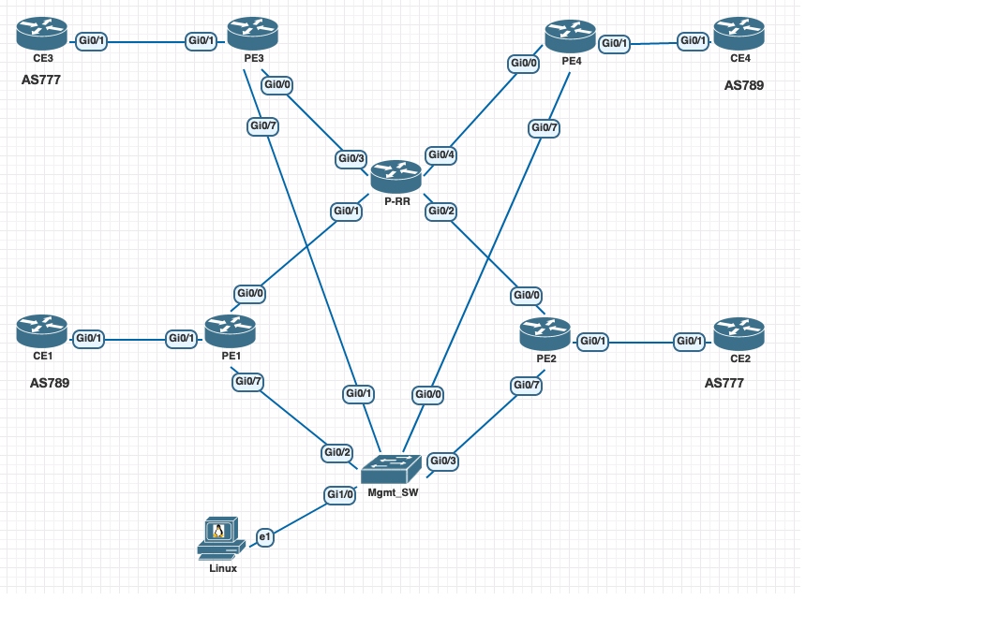

# MPLS L3VPNs Deployment with Nornir



## Getting Started

### Clone Repo

```bash
git clone https://github.com/sbarissonmez/mpls-l3vpns-deploy.git
cd auto_mpls_l3vpn
```
### Create venv

```bash
python3 -m venv venv
```

### Activate venv

```bash
source venv/bin/activate
```

### Install requirements

```bash
pip install -r requirements.txt
```

